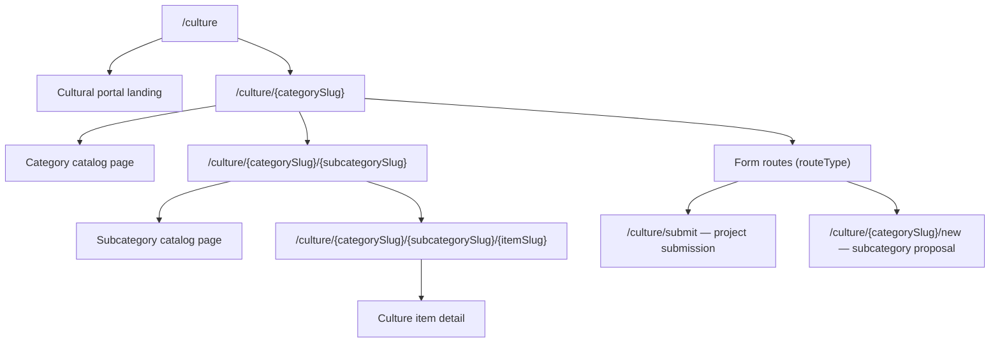

# Culture portal routing

How public culture URLs map to menu nodes, catalog pages, and item detail views.

---

## Route overview

Standalone landing pages (`/khndzoresk`, `/khachaturian-museum`, `/national-gallery-armenia`) are **not** part of the culture menu tree. They use `PageContent` slugs and static components under `components/khndzoresk`, etc.

---

## Menu tree and route types

Culture navigation comes from `CultureMenuItem` rows (seeded in `prisma/seeds/culture-menu.ts`, editable in admin).

| `routeType` | Public behavior |
| --- | --- |
| `CATEGORY` | `/culture/{slug}` — category catalog |
| `SUBCATEGORY` | `/culture/{parentSlug}/{slug}` — subcategory catalog |
| `SUBCATEGORY_FORM` | `/culture/{parentSlug}/new` — propose a sub-catalog |
| `PROJECT_SUBMIT_FORM` | `/culture/submit` — general project submission |
| `CUSTOM_URL` | External or custom link (not a catalog page) |

Helpers in `lib/culture-menu.ts` (`isFormRoute`) and `lib/culture-routes.ts` (`findCategoryPageNode`, `findSubcategoryPageNodes`) gate which slugs resolve to catalog pages vs. forms.

---

## Page files (App Router)

| URL pattern | Page module |
| --- | --- |
| `/culture` | `app/(public)/culture/page.tsx` |
| `/culture/[categorySlug]` | `app/(public)/culture/[categorySlug]/page.tsx` |
| `/culture/[categorySlug]/[subcategorySlug]` | `app/(public)/culture/[categorySlug]/[subcategorySlug]/page.tsx` |
| `/culture/[categorySlug]/[subcategorySlug]/[itemSlug]` | `app/(public)/culture/[categorySlug]/[subcategorySlug]/[itemSlug]/page.tsx` |
| `/culture/submit` | `app/(public)/culture/submit/page.tsx` |
| `/culture/[categorySlug]/new` | `app/(public)/culture/[categorySlug]/new/page.tsx` |

Each catalog page loads the menu tree via `getMenuTree()`, resolves the node with culture-route helpers, then fetches published items with `getItemsByMenuItem` / `getCultureItemBySlug`.

---

## Caching and revalidation

- Menu tree and culture items use `unstable_cache` with tags `culture-menu` and `culture-items` (see `lib/queries/menu.ts`, `lib/queries/culture-items.ts`).
- Admin culture-item CRUD revalidates those tags plus public paths via `lib/cache/revalidation.ts`.
- Admin inbox lists (`/admin/contact-messages`, `/admin/submissions`) are **not** tag-cached; they use `revalidatePath` on mutation only.

---

## Related docs

- [DEPLOYMENT.md](./DEPLOYMENT.md) — CI vs production migrate, smoke checklist
- [R2_STORAGE.md](./R2_STORAGE.md) — public asset URLs used in catalog images

Integration smoke for route ↔ file mapping lives in `tests/smoke.test.ts`.
