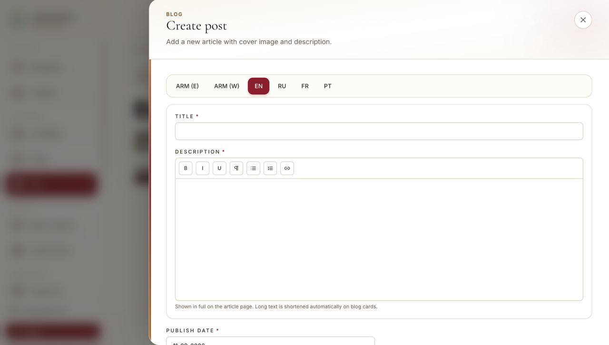
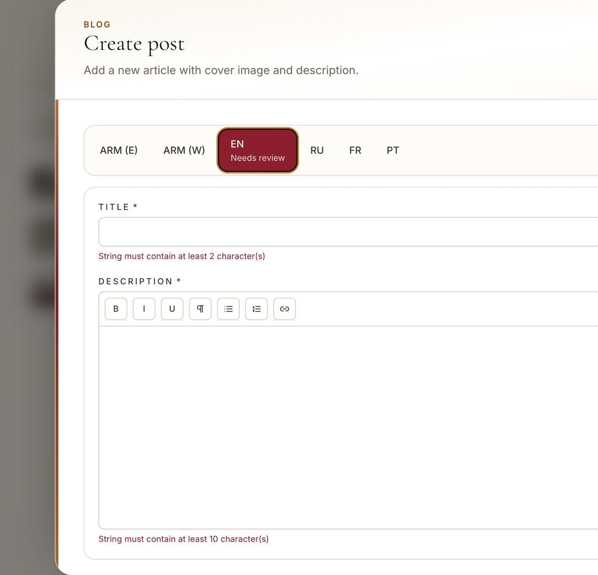
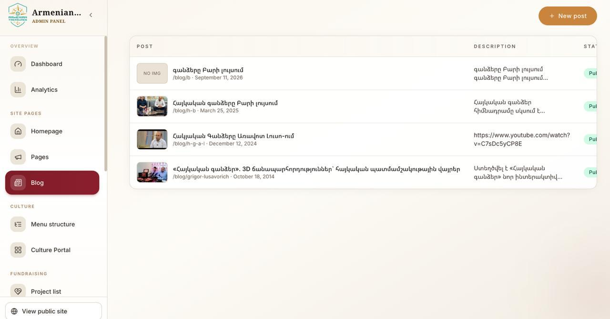
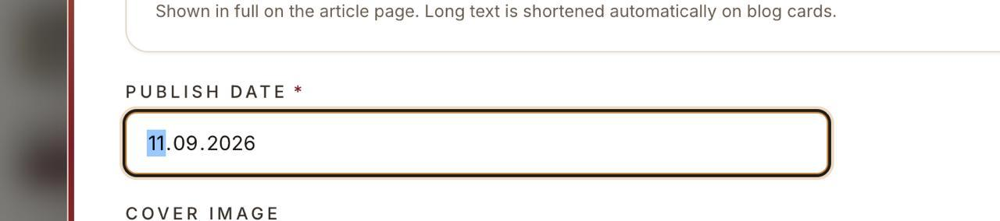
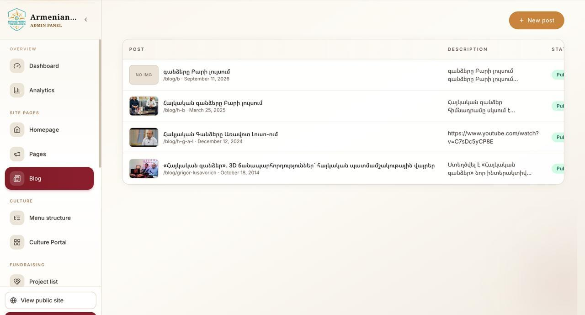

# Treasure blog

Աղբյուր՝ [Treasure blog](https://docs.google.com/document/d/1ZGi4c67YDb9ihx3TtBoQ4Eo4W5Mbfr_erMwxhV2qW8Y/edit?tab=t.0)  
Google Doc tab՝ **Tab 1**  
Այս ֆայլը docs-ի **ամբողջական** պատճենն է՝ նույն կետերով, նույն ձևակերպումներով և նույն screenshot-ներով, իրենց հերթականությամբ։

---

## 1. Blog էջը sheet չբացի, այլ հենց էջում բացի, ինչպես portal post-երն են

**Docs-ի բնօրինակ տեքստ**

> blog ejy senc sheetov chbaci ayl henc ejum baci, inchpes portal postern en

**Ինչ է ասում**

Admin-ում Blog-ի create/edit-ը **չպետք է բացվի որպես sheet / modal / overlay**։ Պետք է բացվի **առանձին էջում**, նույն ձևով, ինչպես Cultural Portal-ի post/item էջերն են բացվում։

**Docs-ում կից նկար** — Create post-ը հիմա sheet/modal է (`Create post`, overlay, X փակել, locale tab-եր, Title, Description, Publish date)։ Սա այն վիճակն է, որ պետք է փոխել։

Screenshot-ում երևում է.

- վերնագիր՝ **BLOG / Create post**
- subtitle՝ *Add a new article with cover image and description.*
- locale tab-եր՝ **ARM (E) · ARM (W) · EN · RU · FR · PT** (ընտրված է EN)
- **TITLE \*** դաշտ
- **DESCRIPTION \*** rich text (B I U ¶ lists link)
- helper text՝ *Shown in full on the article page. Long text is shortened automatically on blog cards.*
- **PUBLISH DATE \***

---

## 2. Ստիպում է English-ը դնեմ, բայց պիտի չստիպի, ու English-ից հենց գնում եմ այլ լեզու՝ քցում ու մաքրում է տեքստերս

**Docs-ի բնօրինակ տեքստ**

> stipuma englishy dnem,, bayc piti chstipi, u englishic henc gnumem ayl lezu qcuma u maqrum texters

**Ինչ է ասում**

1. English-ը **պարտադիր չպետք է լինի**։ Կարողանաս պահպանել post-ը առանց EN լրացնելու։
2. EN-ից այլ լեզու անցնելիս **չպետք է քցի/մաքրի** արդեն գրված տեքստերը։ Locale switch-ը չպետք է wipe անի field-երը։

**Docs-ում կից նկար** — EN tab-ը *Needs review* է, validation error-ներ են գցում։

Screenshot-ում երևում է.

- **EN** tab՝ burgundy, ներքևում **Needs review**
- Title-ի տակ սխալ՝ *String must contain at least 2 character(s)*
- Description-ի տակ սխալ՝ *String must contain at least 10 character(s)*

---

## 3. Blog-երը պետք է ունենան category-ներ

**Docs-ի բնօրինակ տեքստ**

> blogery petqa unenan categoryaner  
> karas blogi tak et bajiny stexces  
> categoryan hierarxia chi unenalu, zut anuny gren, slug u tarber lezuner senc mi ban,, vory heto blog posti mej yntreluen ev frontum blog ejum taberov karanq dnenq en estatei gallery pes, vor yntren vor bajni posternen uzum kardal

**Ինչ է ասում**

- Blog-երը **պետք է ունենան կատեգորիաներ**։
- Admin-ում **Blog-ի տակ** ստեղծել այդ բաժինը (օր. Blog → Categories)։
- Hierarchy **չկա**։ Category-ն հարթ է.
  - անուն
  - slug
  - տարբեր լեզուներ (նույն մոդելով, ինչ մնացած i18n-ը)
- Հետո blog post-ի մեջ category-ն **ընտրվում է**։
- Public `/blog` էջում **tab-երով** ֆիլտր, ինչպես estate gallery-ում՝ օգտվողը ընտրում է՝ որ բաժնի post-երն է ուզում կարդալ։

**Docs-ում կից նկար** — admin Blog list-ի ներկա վիճակը (կատեգորիա չկա, միայն Post / Description / Status)։

Screenshot-ում երևում է.

- sidebar՝ Overview, Site pages (**Blog** ընտրված), Culture, Fundraising
- աջ վերև՝ **+ New post**
- աղյուսակ՝ **POST | DESCRIPTION | STATUS**
- օրինակ տողեր՝ «գանձերը Բարի լույսում», «Հայկական գանձերը Բարի լույսում», YouTube link description-ում, և այլն

---

## 4. Field-երում short description պետք է ավելացնել

**Docs-ի բնօրինակ տեքստ**

> Fielderum short description petqa avelacnel, vory single post ejum chi erevum bayc erevuma vorpes "excerpt" cardi vra aysinqn, es pahin cardi vra erevuma description henc bayc da sxala petqa short description ereva

**Ինչ է ասում**

Blog post field-երում ավելացնել **Short description**.

| Որտեղ | Ինչ ցույց տա |
|--------|----------------|
| Single post էջ (`/blog/[slug]`) | **չի երևում** |
| Blog card / listing | երևում է որպես **excerpt** |

Հիմա card-ի վրա երևում է **description**-ը (ամբողջ/կտրված long text)։ Դա **սխալ է**։ Card-ի վրա պետք է երևա հենց **short description**-ը։

Նշում screenshot-01-ից՝ description helper-ը հիմա ասում է *«Long text is shortened automatically on blog cards»*։ Ըստ այս կետի՝ auto-truncate-ը բավարար չէ, պետք է առանձին excerpt field։

---

## 5. Blog post-երի field-երում slug պետք է ավելացնենք, որը բոլոր լեզուներում նույնն է

**Docs-ի բնօրինակ տեքստ**

> Blog posteri Fielderum slug petqa avelacnenq vory bolor lezunerum nuynna

**Ինչ է ասում**

Post-ի field-երում ավելացնել **slug**։

- slug-ը **մեկն է բոլոր locale-ների համար** (ոչ թե HY/EN/RU առանձին slug)
- public URL-ը նույնն է բոլոր լեզուներում, օր. `/blog/grigor-lusavorich`

---

## 6. Blog-ը պետք է անենք cultural portal-ների պես՝ տեղաշարժվող block-եր

**Docs-ի բնօրինակ տեքստ**

> Blogy petqa anenq cultural portalneri pes aysinqn lini mi qani description vory karanq texasharjenq, linkeri hnaravorutyun vor youtube linker dnenq, gallery hnaravourtyun vory nuynpes blockov add karanq anenq, heading gaxapar mi qani hat add anelu, headingy kara mi toxani text area lini. Orinak menq karoxa unenq senc karucvacq - title description photo, youtube link, gallery, heading, description, link, photo. Dra hamar mez petqa blockeri texasharjman gaxapar

**Ինչ է ասում**

Blog editor-ը պետք է լինի **Culture item / cultural portal**-ի նման՝ **reorderable content blocks**, ոչ թե մեկ Title + մեկ Description։

Պետք է կարողանաս **ավելացնել և տեղաշարժել** այս տիպի block-եր.

| Block | Նշում docs-ից |
|-------|----------------|
| Description | մի քանի հատ, տեղաշարժելի |
| Link | հղումներ |
| YouTube link | YouTube embed |
| Gallery | gallery-ն էլ block է, add ես անում |
| Heading | մի քանի հատ add, **մի տողանի textarea** |
| Photo | նկար block |

**Օրինակ կառուցվածք docs-ից (հերթականությամբ).**

1. title  
2. description  
3. photo  
4. youtube link  
5. gallery  
6. heading  
7. description  
8. link  
9. photo  

Դրա համար պետք է **block-երի տեղաշարժման գաղափար** (drag/reorder, ինչպես culture item editor-ում)։

---

## 7. Calendar-ով դնենք, որ հեշտ լինի date-ը փոխել

**Docs-ի բնօրինակ տեքստ**

> calendarov dnenq vor hesht lini datan pxoel

**Ինչ է ասում**

Publish date-ը **calendar picker** լինի, ոչ թե ձեռքով գրվող տեքստ։ Որպեսզի date-ը հեշտ փոխվի։

**Docs-ում կից նկար** — հիմա սովորական text input է (`11.09.2026`)։

Screenshot-ում երևում է.

- **PUBLISH DATE \***
- արժեք՝ `11.09.2026` (մասամբ select արված)
- ներքևում **COVER IMAGE** label

---

## 8. Այս մասը դզել՝ title 2 տող, description սյունակը հանել, վերևում search, category սյունակ

**Docs-ի բնօրինակ տեքստ**

> es masy dzel, title-y 2 tox ete tenc erkara,,, description syunyaky hani, verevy search avelacnenq, categorya syunyak dnenq

**Ինչ է ասում — admin Blog list աղյուսակը փոխել**

| # | Փոփոխություն |
|---|-------------|
| 1 | **Title**-ը եթե երկար է՝ **2 տող wrap** |
| 2 | **Description սյունակը հանել** |
| 3 | Վերևում **search** ավելացնել |
| 4 | **Category սյունակ** ավելացնել |

**Docs-ում կից նկար** — նույն Blog list-ը, որ պետք է «դզել».

Screenshot-ում երևում է նույն խնդիրները, որոնք կետը նկարագրում է.

- երկար title-ները մի տողով կտրվում են
- **DESCRIPTION** սյունակ կա (պետք է հանվի)
- search չկա
- category սյունակ չկա
- Description սյունակում երբեմն YouTube URL է երևում (`https://www.youtube.com/watch?v=...`)

---

## Docs-ի կետերի ամփոփ աղյուսակ

| # | Կետ | Screenshot |
|---|-----|------------|
| 1 | Create/edit-ը **էջ** լինի, ոչ sheet/modal, ինչպես portal post-երը | `screenshot-01.jpg` |
| 2 | EN **պարտադիր չէ**։ Locale փոխելիս **տեքստերը չմաքրվեն** | `screenshot-02.jpg` |
| 3 | **Categories**՝ Blog-ի տակ, առանց hierarchy, name + slug + լեզուներ, post-ում select, front-ում tab-եր | `screenshot-03.jpg` |
| 4 | **Short description** field՝ card excerpt, single post-ում չի երևում | — |
| 5 | **Slug**՝ մեկը բոլոր լեզուների համար | — |
| 6 | **Reorderable blocks**՝ cultural portal-ի պես (description, youtube, gallery, heading, link, photo) | — |
| 7 | Publish date՝ **calendar picker** | `screenshot-04.jpg` |
| 8 | List՝ title wrap 2 տող, հանել description column, ավելացնել search + category column | `screenshot-05.jpg` |
